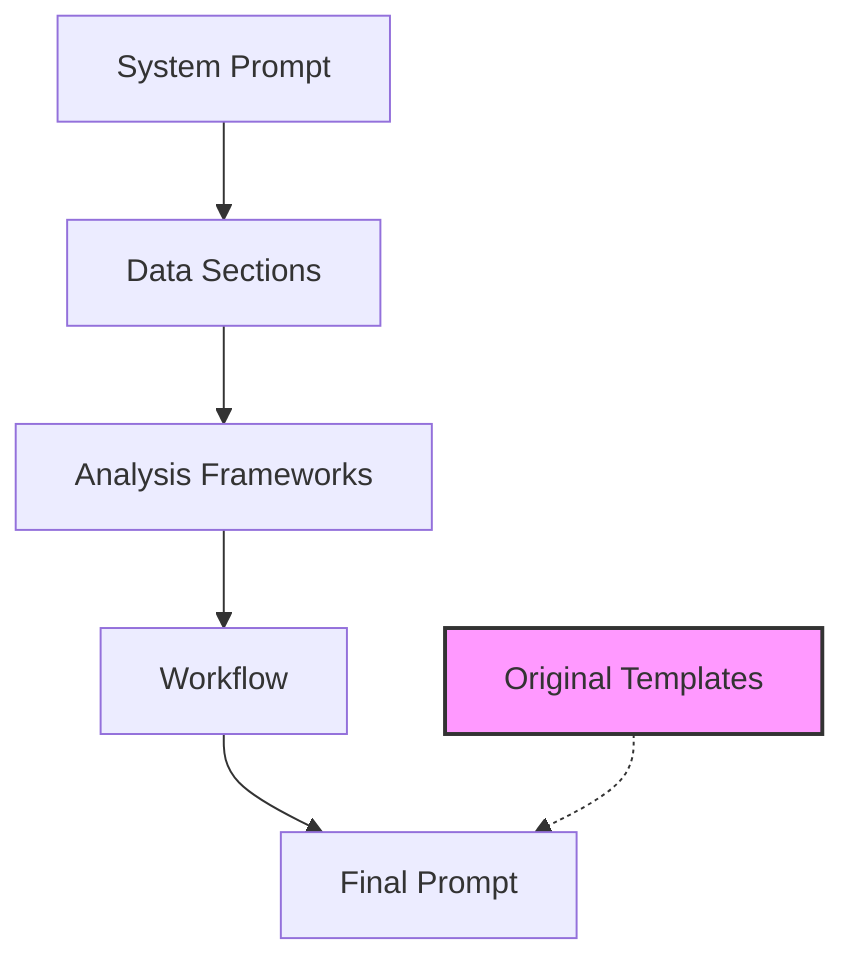
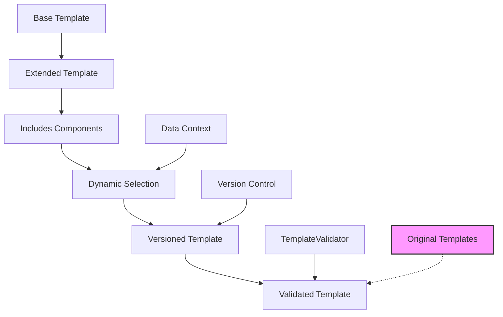

# Template Architecture Documentation

## Overview
The template system has been restructured into a modular architecture to improve reusability, maintainability, and extensibility. The original template files in `templates/` remain intact to preserve backward compatibility with the current [`TemplateManager`](templates_manager.py:5) usage. New modular components are organized in subdirectories under `templates/`.

This structure allows for composing prompts by combining base elements (system prompts, data sections, analysis frameworks) into workflows. Future phases can update the TemplateManager to load and compose these components dynamically.

## Directory Structure
```
templates/
├── *.txt (original templates - unchanged for compatibility)
├── base/
│   ├── system_prompts/          # Core system prompts for agents
│   │   ├── no_tools_analysis.txt
│   │   └── main_agent.txt
│   ├── data_sections/           # Reusable data insertion blocks
│   │   ├── activity_summary.txt
│   │   ├── user_info.txt
│   │   ├── training_rules.txt
│   │   ├── workout_data.txt
│   │   ├── workouts_data.txt
│   │   ├── available_tools.txt
│   │   └── recent_data.txt
│   └── analysis_frameworks/     # Common analysis structures and instructions
│       ├── assessment_points.txt
│       ├── performance_analysis.txt
│       └── data_gathering.txt
├── components/                  # General reusable components (to be populated in future phases)
└── workflows/                   # Composed prompt templates using base components
    ├── single_workout_analysis.txt
    ├── analyze_last_workout.txt
    ├── suggest_next_workout.txt
    └── workout_recommendation.txt
```

## Component Relationships

### Base Components
- **System Prompts** (`templates/base/system_prompts/`): Define the AI's role and behavior.
  - `no_tools_analysis.txt`: For analysis without tool calls (extracted from `enhanced_temp_system_prompt.txt` and `temp_analysis_system_prompt.txt`).
  - `main_agent.txt`: For the main agent with tool access (extracted from `main_agent_system_prompt.txt`).

- **Data Sections** (`templates/base/data_sections/`): Standardized blocks for inserting dynamic data with consistent formatting.
  - Used in workflows to insert placeholders like `{activity_summary_section}` which would load and format the corresponding file.
  - Examples: `{user_info_section}` inserts user profile data.

- **Analysis Frameworks** (`templates/base/analysis_frameworks/`): Reusable instruction sets for common analysis patterns.
  - `assessment_points.txt`: Standard list of analysis outputs (e.g., assessment, alignment, improvements).
  - `performance_analysis.txt`: Focus areas for performance metrics and recommendations.
  - `data_gathering.txt`: Instructions for tool usage in data collection and risk assessment.

### Workflows
Workflows in `templates/workflows/` compose the base components to recreate original template functionality modularly.
- **Composition Pattern**: Each workflow includes:
  - Introductory text specific to the use case.
  - Inclusions of data sections (e.g., `{training_rules_section}`).
  - Analysis frameworks (e.g., `{assessment_points}`).
  - Closing instructions.

Examples:
- `single_workout_analysis.txt`: Uses `{workout_data_section}`, `{rules_section}`, `{assessment_points}`.
- `analyze_last_workout.txt`: Uses `{activity_summary_section}`, `{user_info_section}`, `{training_rules_section}`, `{assessment_points}`.
- `suggest_next_workout.txt`: Uses `{training_rules_section}` and custom recommendation points.
- `workout_recommendation.txt`: Uses `{workouts_data}` and `{rules}` directly, with recommendation structure.

### Backward Compatibility
- All original `.txt` files in `templates/` are preserved.
- The [`TemplateManager`](templates_manager.py:16) continues to load them via `get_template(template_name, **kwargs)`.
- New workflows can be loaded similarly, but composition logic (e.g., replacing `{section}` placeholders) will be implemented in future phases.

#### Legacy Path Mapping
To support gradual migration from old template paths to the new modular structure, the TemplateManager includes a legacy mapping layer:
- Legacy template names are automatically redirected to their new locations.
- Example: `'main_agent_system_prompt.txt'` maps to `'base/system_prompts/main_agent.txt'`.
- Deprecation warnings are logged when legacy paths are used to encourage migration.
- Mappings are defined in `legacy_mappings` dictionary in both TemplateManager and TemplateValidator classes.

### Phase 4: Advanced Template Features

#### Template Inheritance System
Templates can now use inheritance syntax to extend base templates and include reusable components:

**Extends Syntax:**
```
extends: base_template_name
```

**Includes Syntax:**
```
includes:
  - component1
  - component2
```

The system supports multiple inheritance levels with conflict resolution (child overrides parent).

#### Dynamic Component Selection
Components are selected based on available data types in the context:
- If `workout_data` is present → include `workout_data_section`
- If `user_info` available → include `user_info_section`
- If `training_rules` provided → include `training_rules_section`

Selection logic uses a priority-based system with fallback defaults.

#### Template Versioning for A/B Testing
Templates support versioning with `@version` syntax:
- `template@v1.0` - specific version
- `template@latest` - most recent version
- `template@random` - random version for A/B testing

Version metadata includes:
- Version number (semantic versioning)
- Creation date
- Author
- Test metrics (conversion rates, performance)

#### TemplateValidator
New validator class performs:
- Inheritance cycle detection
- Component existence validation
- Syntax validation for extends/includes
- Version format checking
- Backward compatibility verification

#### Version Control Integration
Templates are stored in a version-controlled structure:
```
templates/
├── versions/
│   ├── template_name/
│   │   ├── v1.0.txt
│   │   ├── v1.1.txt
│   │   └── v2.0.txt
├── base/ (unchanged)
├── components/ (unchanged)
└── workflows/ (unchanged)
```

### Future Enhancements
- Update TemplateManager to support component composition (e.g., recursive loading of sections).
- Add more components to `templates/components/` for shared UI/logic elements.
- Integrate with MCP tools for dynamic prompt generation.

## Mermaid Diagram: Component Composition Example

This diagram shows how base components feed into workflows, with originals as a fallback.

## Mermaid Diagram: Phase 4 Template Inheritance and Versioning

This diagram illustrates the Phase 4 enhancements: inheritance extends base templates, includes add components, dynamic selection adapts to data, versioning enables A/B testing, and validation ensures correctness, while maintaining backward compatibility.